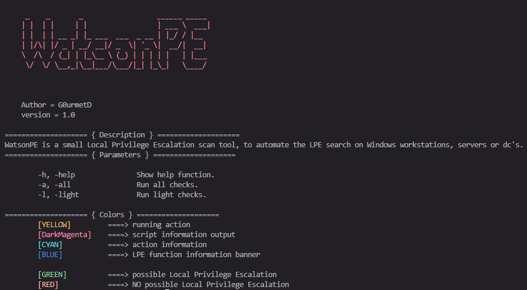

# WatsonPE
WatsonPE is a small Local Privilege Escalation scan tool, to automate the LPE search on Windows workstations, servers or dc's.
The tool is based on https://book.hacktricks.xyz/ & winPEAS stuff.



## Usage

```PowerShell

# default call - uses light scan
.\WatsonPE.ps1

# calling help function (colors explanation)
.\WatsonPE.ps1 -h

# calls light scan
.\WatsonPE.ps1 -light

# calls heavy scan (in development)
.\WatsonPE.ps1 -all
```

## Modulinformation
# WatsonPE

===== { Computer } =====
- [x] kernel information/system information
- [x] check if domain joined
- [x] PS, Audit, WEF and LAPS Settings
- [x] LSA protection
- [x] credential guard
- [x] wdigest
- [x] Number of cached cred
- [x] Environment Variables
- [x] UAC configuration
- [x] Spooler
- [x] Weak registry settings

===== { Users } =====
- [x] Current logged users
- [x] RDP sessions
- [x] Ever logged users
- [x] Autologin credentials
- [x] Logon Sessions
- [x] localgroups and file access

===== { Processes } =====
- Interesting processes (non Microsoft)

===== { Processes } =====
- Interesting services (non Microsoft) information
- Modifiable services
- Writable service registry binpath
- PATH Dll Hijacking

===== { Windows Credentials } =====
- [x] Windows Vault
- [x] Credential Manager
- [x] Saved RDP settings
- [x] DPAPI Masterkeys
- [x] DPAPI Credential files
- [x] Remote Desktop Connection Manager credentials
- [x] Kerberos Tickets
- [x] Wifi creds
- Security Package Credentials
- [x] AlwaysInstallElevated

===== { Browser } =====
Extracting saved passwords for: Firefox, Chrome, Opera, Brave

===== { PuTTY } =====
- [x] PuTTY sessions
- [x] PuTTY ssh host keys
- [x] ssh keys inside registry

===== { interesting files & registry } =====
- [x] Check for unattended files
- [x] Check for SAM & SYSTEM backups
- Check for cached GPP Passwords
